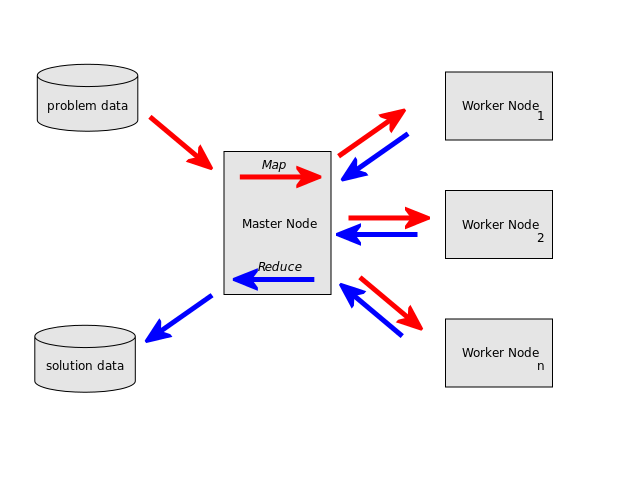

=======
NoSQL
=======

------------------------------------------------
NoSQL bāzētu datubāzu vadības sistēmu apraksts
------------------------------------------------


.. raw:: pdf
	
	SetPageCounter 0 arabic
	PageBreak oneColumn


.. contents:: Saturs
	:depth: 3

.. raw:: pdf

	PageBreak


NoSQL datubāzes
================= 

NoSQL (*not only SQL*, *no SQL*) ir t.s. lietussarga termins, kas apzīmē datubāzu vadības sistēmas, kuru kopīgā īpašība ir pretstats klasiskajam relāciju datu modelim [1]_. Šīs DBVS ir optimizētas priekš datu izgūšanas un pievienošanas, un ir noderīgas lieliem datu apjomiem. Neizmantojot relāciju datu modeli, ir atvieglota mērogošana, it īpaši horizontāla mērogošana, jeb jaunu datoru, serveru pievienošana sistēmai.

Šīm datubāzu vadības sistēmām parasti nav fiksētas shēmas, kādā tiek glabāti dati. Parasti dati tiek glabāti atslēgu-vērtību krājumā, grafu kopā, dokumentu krājumā vai objektu kopā. Manipulācijai ar datiem tiek izmantota nevis SQL valoda, bet DBVS specifisks interfeiss- binārs vai tekstuāls.

NoSQL datubāzu vadības sistēmām ir arī trūkumi, proti:

* Sarežģītāk nodrošināt datu integritāti- tas jānodrošina lietojumprogrammas līmenī. 
* Parasti tiek garantēta tikai galīga konsistence [2]_, kas nozīmē, ka izmaiņas visā sistēmā nenotiek vienlaicīgi, bet izplatās vienmērīgi, kamēr nenotiek jaunas izmaiņas.
* Globālās shēmas trūkums ir sarežģīts no dokumentācijas un projekta uzturēšanas viedokļa- var nebūt viena avota, kurā ir redzama visu datu struktūra.
* Lielākajā daļā realizāciju neeksistē *JOIN* koncepts, par saistīto datu izgūšanu ir atbildīga lietojumprogramma.

.. raw:: pdf

	PageBreak

Kategorizācija pēc datu modeļa
================================

Izplatīts veids [1]_, [3]_ kā iedalīt, kategorizēt NoSQL DBVS ir pēc izmantotā datu glabāšanas modeļa. Izšķir sekojošus datu glabāšanas modeļus:

* Dokumentu krātuve (*document store*).
* Atslēga-vērtība krātuve (*key-value store*).
* Grafu datubāze.
* Tabulāra krātuve (*tabular store*).
* Objektu datubāze.
* XML datubāze.

Dokumentu krātuve (*document store*)
-------------------------------------

Dokumentu krātuves modelī galvenais elements ir "dokuments". Katrai NoSQL realizācijai ir nedaudz atšķirīga dokumenta definīcija, taču ir pieņemts, ka dokuments iekapsulē un satur datus. Dati var būt dažādos formātos- gan tekstuālos (XML, YAML, JSON), gan bināros (PDF, Microsoft Office formāti, BSON).

Katram dokumentam ir piekārtots unikāls identifikators, pēc kura nekļūdīgi var izgūt dokumentu. Parasti tiek sniegtas arī papildu iespējas dokumentu meklēšanai pēc metadatiem vai satura, tomēr katrā dokumentu krātuvē tas tiek realizēts savādāk.

Dokumentu organizācijai arī tiek izmantoti dažadi paņēmieni- organizācija pēc metadatiem, birkas, kolekcijas kā arī direktoriju hierarhijas.

Dokuments konceptuāli ir līdzīgs rindai relāciju datubāzu sistēmās, taču atšķirībā no relāciju datubāzes- dokumenti var būt ar dažādu struktūru, dažādiem laukiem. Kolekcijas, jeb dokumentu grupas līdzinās tabulām relāciju sistēmās, bet relāciju sistēmās vienā tabulā katras rindas struktūra ir identiska- dokumentu krātuvē dokumentu struktūra kolekcijā var atšķirties.

.. image:: images/rel_db.jpg
	:width: 40%

Relāciju datubāzes tabula.

.. image:: images/mongodb.jpg
	:width: 50%

Līdzīgas struktūras kolekcija MongoDB [4]_ datubāzē.

Šajā piemērā ir attēlota MongoDB kolekcija ar diviem dokumentiem. "_id" lauks ir automātiski ģenerēts ievietojot dokumentu. Tas ir unikāls, un to izveido MongoDB, automātiski. Pēc šī lauka dokumentu var unikāli identificēt un izgūt.

MongoDB dokumenti fiziski tiek glabāti BSON [5]_ formātā, kas būtībā ir binārs pieraksts JSON (*JavaScript Object Notation*) formātam, lai samazinātu glabājamo datu daudzumu un sistēmas ātrdarbību. Lietotājam dati tiek attēloti JSON formātā, kā redzams iepriekšējā piemērā.


*Map-Reduce*
``````````````
Map-reduce [10]_ ir programmēšanas paņēmiens lielu datu kopu apstrādei paralēli. To parasti izmanto izplatītās datorsistēmās, lai apstrādātu lielu datu kopu, un atgrieztu apstrādes rezultātus izsaucējam. NoSQL dokumentu krātuves realizācijas atbalsta šo paņēmienu, vai analogu, lai datus varētu ne tikai glabāt un izgūt pēc identifikatora, bet arī lai veiktu datu agregāciju, filtrēšanu, kārtošanu vai cita veida datu apstrādi.




Pielietojumi
``````````````

Dokumentu krātuves ir noderīgas gadījumiem, kad jāglabā liels apjoms ierakstu un šie ieraksti tiek bieži lasīti un pievienoti, retāk- dzēsti. Tā kā dokumentu struktūra nav fiksēta, dokumentu struktūra var attīstīties reizē ar lietojumprogrammu.

Realizācijas bieži piedāvā arī efektīvus paņēmienus dokumentu meklēšanai pēc satura, un dokumentu apstrādei paralēli, izmantojot *MapReduce*.


Realizācijas
``````````````
* `Apache CouchDB <http://couchdb.apache.org/>`_
	http://couchdb.apache.org/
* `MongoDB <http://mongodb.org>`_
	http://mongodb.org/
* `Oracle NoSQL Database <http://www.oracle.com/technetwork/products/nosqldb/overview/index.html/>`_ 
	http://www.oracle.com/technetwork/products/nosqldb/overview/index.html/


Atslēga-vērtība krātuve (*key-value store*)
-----------------------------------------------

Atslēga-vērtība krātuvēs tiek izmantots atslēga-vērtība koncepts. Katrs ieraksts ir atslēgas-vērtības kortežs. Lielākajā daļā realizāciju, atslēga var būt primitīvs datu tips (teksta virkne, skaitlis), savukārt vērtība- salikts datu tips, kas var sastāvēt no sarakstiem, asociatīviem masīviem, teksta virknēm, kā arī primitīviem datu tipiem.

Atslēgas-vērtības krātuvēs dati parasti izskatās šādi::

	Atslēga 		Vērtība
	students_1		{"vards": "Pēcis Beisikāns", "grupa": "DB3"}
	students_2		{"vards": "Maija Saprātiņa", "grupa": "DB3"}
	grupa_DB3		{"nosaukums": "DB3", "fakultate": "DITF"}		
	DITF_skaits		1028
	DITF_adrese		"Meža iela 1, Rīga"

Atslēgas-vērtības krātuves konceptuāli ir līdzīgas dokumentu krātuvēm- katra atslēga ir unikāls identifikators, bet pretstatā dokumentu krātuvēm, vērtības ieraksts, jeb saturs nav strikti formatēts kādā noteiktā formātā.

Parasti atslēgas-vērtības datu krātuves lietojumprogrammu interfeisi pēc atslēgas atgriež datus jau programmatūras valodai specifiskos datu tipos.

.. code-block:: pycon
	:linenos:

	>>> import redis
	>>> r = redis.Redis()
	>>> r.sadd('atslega',(1,2,3))
	1
	>>> r.smembers('atslega')
	set(['(1, 2, 3)'])

	>>> r.set('vienkarsaatslega', 'abc')
	True
	>>> r.get('vienkarsaatslega')
	'abc'

Šajā koda paraugā tiek izmantots Redis [6]_ programmēšanas valodā Python ar redis-py [7]_ bibliotēku piekļūšanai pie Redis datubāzes. Pirmās divas koda rindiņas ir atbildīgas par pieslēgšanos datubāzei, ar uzstādījumiem pēc noklusējuma (serveris: localhost, ports: 6379). ``r.sadd(<atslēga>, <kopa>)`` metode tiek izmantota, lai kopai ar nosaukumu <atslēga> pievienotu elementus 1,2,3. Pēc tam ar komandas ``r.smembers(<atslēga>)`` palīdzību tiek nolasīts kopas saturs.

Pēdējās divās rindiņās tiek demonstrēta primitīva datu tipa, teksta virknes saglabāšana Redis datubāzē.

Atomāras darbības 
````````````````````

Dažas atslēgu-vērtību krātuves piedāvā arī atomāras darbības ar atslēgas vērtību- pievienot ierakstu, ja tas neeksistē, palielināt atslēgas vērtību. Atomāra darbība, vai nu izpildās veiksmīgi, vai neatstāj ietekmi uz datiem. Tas ir īpaši svarīgi izplatītās sistēmās, kur atomāru darbību izmantošana ļauj izvairīties no *race condition*. Šo piemēru vislabāk var ilustrēt sekojošs koda paraugs:

.. code-block:: python

	import redis
	r = redis.Redis()
	value = r.get('atslega')
	value = value + 1
	r.set('atslega')

Ja šis kods tiek izpildīts divās plūsmās, vienlaicīgi, ir iespējams, ka abas plūsmas nolasa atslēgas vērtību vienā brīdī, tādējādi ``value`` abās plūsmās ir vienāda vērtība. Katra plūsma izpilda saskaitīšanas operāciju, un rezultāta ieraksta vienādu vērtību.

Lai no tā izvairītos, konkrēti Redis datubāze piedāva operāciju inc, kas ir atomāra atslēgas vērtības palielināšanas operācija:

.. code-block:: python

	import redis
	r = redis.Redis()
	r.inc('atslega')

Šis koda fragments izpildoties vienmēr palielinās vērtību par viens, arī ja izpildīsies vairākās plūsmās vienlaicīgi.


Pielietojumi
````````````````

Galvenais pielietojums atslēgu-vērtību krātuvēm ir relatīvi īsu, taču daudzskaitlīgu datu glabāšanai, it īpaši izplatītās sistēmās (darbojas paralēli uz vairākiem datoriem). Datu kopa bieži vien tiek glabāta operatīvajā atmiņā, tāpēc datu izgūšana ir zibenīga, taču ar iespējamiem konsistences trūkumiem. Datus, kuru zaudējums nav pieļaujams noteikti nevajadzētu glabāt atslēgas-vērtības tabulā. Savukārt, dati, kuru zaudējums neatstāj lielu ietekmi uz sistēmas darbību, bet tiek bieži izmantoti var tikt glabāti atslēgas-vērtības krātuvēs.


Atslēgu-vērtību krātuves tiek izmantotas arī iegultajās sistēmās, jo tās ir viegli apstrādājamas lielākajā daļā programmēšanas valodu. HTML5 [8]_ standarts [9]_ paredz izmantot atslēgas-vērtības krātuvi datiem, ko tīmekļa vietne var saglabāt lietotāja iekārtā. 

Pašreizējās realizācijas tīmekļa pārlūkos diemžēl pieļauj tikai teksta-virknes vērtības- lai glabātu saliktas vērtības, lietojumprogrammas izstrādātājam pašam jārūpējas par datu serialēšanu un de-serializēšanu.


Realizācijas
````````````````

* `Redis <http://redis.io/>`_ 
	http://redis.io/
* `Memcached <http://memcached.org/>`_ 
	http://memcached.org/
* `Apache Cassandra <http://cassandra.apache.org/>`_ 
	http://cassandra.apache.org/


Grafu datubāzes
---------------------

Grafu datubāzes, kā to liecina nosaukums, ir radītas datu glabāšanai, kuru attieksmes ir attēlojamas kā viens vai vairāki grafi (galīgs skaits elementu ar nenoteiktu skaitu saišu starp tiem). Tās ir bāzētas uz grafu teorijas.

.. image:: images/graph.png
	:width: 80%


Grafu datubāzēs gan virsotnei, gan šķautnēm var būt piesaistītas īpašības, kas var būt gan primitīvi, gan salikti dati. Šādas datubāzes var realizēt izmantojot arī dokumentu krātuves un atslēgas-vērtības krātuves, attieksmes glabājot kā īpašības, taču grafu datubāzēm parasti ir speciālas konstrukcijas efektīvai grafa pārmeklēšanai un glabāšanai.

Virsotnes parasti attēlo datu vienību- cilvēkus, dokumentus, lietotāju kontus, transporta pieturas vai kādu citu informāciju, ko jāglabā lietojumā.
Šķautnes ir attiecības starp virsotnēm.
Īpašības ir datu vienībām vai šķautnēm piekārtota informācija (grafu teorijas "svara" jēdziena paplašinājums).

Grafu datubāzes, salīdzinājumā ar relāciju datubāzem parasti ļauj ātrāk pārmeklēt grafu, kā arī mērogot datus horizontāli. Realizācijas parasti piedāvā pārmeklēšanas algoritmus, kas izpildās jau pašā datubāzē, piemēram, īsākā ceļa meklēšana starp virsotnēm.


Pielietojumi
`````````````

Tādu datu glabāšana, ko saprotami var aprakstīt ar grafu teorijas palīdzību, piemēram, draudzības saites starp cilvēkiem sociālajos tīklos, sabiedriskā transporta sistēma (virsotnes- pieturas, šķautnes- pieturu secība, īpašības uz šķautnēm- pārvietošanās laiks).

Šos pielietojumus, protams, var realizēt arī relāciju datubāzu sistēmās, taču grafu datubāzes šādu uzdevumu veikšanai varētu būt piemērotākas.


Realizācijas
`````````````
* `Neo4j <http://neo4j.org/>`_
	http://neo4j.org/
* `Titan <http://thinkaurelius.github.com/titan/>`_
	http://thinkaurelius.github.com/titan/
* `VertexDB <http://www.dekorte.com/projects/opensource/vertexdb/>`_
	http://www.dekorte.com/projects/opensource/vertexdb/


.. raw:: pdf

	PageBreak

Secinājumi
===========

Nav sliktu vai labu darbarīku- ir tikai uzdevumam piemēroti darbarīki un uzdevumam nepiemēroti darbarīki. NoSQL datubāzes necenšās aizstāt tradicionālās, relāciju datubāzes. NoSQL datubāzes ir radītas specifiskiem pielietojumiem- visbiežāk, augstai veiktspējai, un mērogojamībai (it īpaši- horizontālai). Tradicionālās relāciju datubāzes arī var lietot šādu uzdevumu veikšanai, taču tas ir grūtāk, jo relāciju datubāzu pamatā jau ir datu integritātes un konsistences nodrošināšana- lietas, kuras NoSQL datubāzes samaina pret veiktspējas uzlabojumiem.

NoSQL termins un kustība ir aizsākusies relatīvi nesen (lai gan arī pirms NoSQL termina eksistences, eksistēja datubāzes, kuras tagad dēvē par NoSQL datubāzēm)- 2009. gadā. Pamata pielietojums šīm datubāzēm ir jaunākās paaudzes tīmekļa lietojumu izstrādei un uzturēšanai. Augošā virtualizācijas sfēra arī ir devusi grūdienu NoSQL kustībai- ir viegli ieslēgt papildus datubāzes serverus, kad lietojuma apmeklētība aug, un tos izslēgt, kad lietojuma apmeklētība krītās. Piemēram- interneta veikalu apmeklētība Ziemassvētku periodā palielinās aptuveni par trešdaļu, salīdzinot ar pārējo gada periodu [11]_. Izmantojot NoSQL datubāzes, ir viegli uz šo brīdi ieslēgt papildus virtuālos serverus, kas pilda datubāzes serveru funkcijas, un pārējā periodā, šos serverus izslēgt. Lielākā daļa realizāciju ir paredzētas iespējas uz atsevišķa servera glabājamos datus "izdalīt" pārējiem serveriem, tādējādi izvairoties no datu zaudēšanas.

Jebkuram izstrādātājam, kuram ir nācies izmantot relāciju datubāzi grafu struktūru glabāšanai, apzinās, ka tas nav viegls uzdevums, un gala rezultāts bieži vien nav optimāls no skaitļošanas resursu izmantošanas viedokļa. Tāpēc šādu struktūru uzglabāšanai un apstrādei piemērotākas ir grafu datubāzes.


.. raw:: pdf

	PageBreak

Atsauces
===========

.. [1] NoSQL - Wikipedia. Sk. 05.01.2013. 
		http://en.wikipedia.org/wiki/NoSQL
.. [2] Eventual Consistency - Wikipedia. Sk. 05.01.2013.
	http://en.wikipedia.org/wiki/Eventual_consistency
.. [3] NoSQL database. Sk. 06.01.2013.
	http://nosql-database.org/
.. [4] MongoDB. Sk. 06.01.2013. 
	http://mongodb.org/
.. [5] MongoDB user manual. Sk. 06.01.2013. 
	http://docs.mongodb.org/manual/reference/glossary/#term-bson
.. [6] Redis key-value store. Sk. 06.01.2013. 
	http:://redis.io/
.. [7] Redis-py library. Sk. 06.01.2013. 
	https://github.com/andymccurdy/redis-py
.. [8] HTML5 feature overview. Sk. 06.01.2013. 
	http://www.html5rocks.com/en/features/storage
.. [9] Web Storage. W3C Candidate Recommendation, Ian Hickson, 2011. Sk. 06.01.2013. 
	http://www.w3.org/TR/2011/CR-webstorage-20111208/
.. [10] MapReduce - Wikipedia. Sk. 07.01.2013. 
	http://en.wikipedia.org/wiki/MapReduce
.. [11] Amazon.com estimated visitors- Quantcast Inc. Sk. 07.01.2013. 
	http://www.quantcast.com/amazon.com

.. footer::
	###Page###

.. sectnum::
