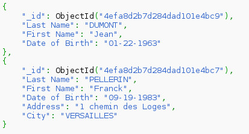

=======
NoSQL
=======

NoSQL (*not only SQL*, *no SQL*) ir t.s. lietussarga termins, kas apzīmē datubāzu vadības sistēmas, kuru kopīgā īpašība ir pretstats klasiskajam relāciju datu modelim [1]_. Šīs DBVS ir optimizētas priekš datu izgūšanas un pievienošanas, un ir noderīgas lieliem datu apjomiem. Neizmantojot relāciju datu modeli, ir atvieglota mērogošana, it īpaši horizontāla mērogošana, jeb jaunu datoru, serveru pievienošana sistēmai.

Šīm datubāzu vadības sistēmām parasti nav fiksētas shēmas, kādā tiek glabāti dati. Parasti dati tiek glabāti atslēgu-vērtību krājumā, grafu kopā, dokumentu krājumā vai objektu kopā. Manipulācijai ar datiem tiek izmantota nevis SQL valoda, bet DBVS specifisks interfeiss- binārs vai tekstuāls.

NoSQL datubāzu vadības sistēmām ir arī trūkumi, proti:

* Sarežģītāk nodrošināt datu integritāti- tas jānodrošina lietojumprogrammas līmenī. 
* Parasti tiek garantēta tikai galīga konsistence [2]_, kas nozīmē, ka izmaiņas visā sistēmā nenotiek vienlaicīgi, bet izplatās vienmērīgi, kamēr nenotiek jaunas izmaiņas.
* Globālās shēmas trūkums ir sarežģīts no dokumentācijas un projekta uzturēšanas viedokļa- var nebūt viena avota, kurā ir redzama visu datu struktūra.
* Lielākajā daļā realizāciju neeksistē *JOIN* koncepts, par saistīto datu izgūšanu ir atbildīga lietojumprogramma.

Kategorizācija pēc datu modeļa
================================

Izplatīts veids [1]_, [3]_ kā iedalīt, kategorizēt NoSQL DBVS ir pēc izmantotā datu glabāšanas modeļa. Izšķir sekojošus datu glabāšanas modeļus:

* Dokumentu krājums (*document store*).
* Atslēga-vērtība krājums (*key-value store*).
* Tabulārs krājums (*tabular store*).
* Grafu datubāze.
* Objektu datubāze.
* XML datubāze.

Dokumentu krājums (*document store*)
-------------------------------------

Dokumentu krājuma modelī galvenais elements ir "dokuments". Katrai NoSQL realizācijai ir nedaudz atšķirīga dokumenta definīcija, taču ir pieņemts, ka dokuments iekapsulē un satur datus. Dati var būt dažādos formātos- gan tekstuālos (XML, YAML, JSON), gan bināros (PDF, Microsoft Office formāti, BSON).

Katram dokumentam ir piekārtots unikāls identifikators, pēc kura nekļūdīgi var izgūt dokumentu. Parasti tiek sniegtas arī papildu iespējas dokumentu meklēšanai pēc metadatiem vai satura, tomēr katrā dokumentu krājumā tas tiek realizēts savādāk.

Dokumentu organizācijai arī tiek izmantoti dažadi paņēmieni- organizācija pēc metadatiem, birkas, kolekcijas kā arī direktoriju hierarhijas.

Dokuments konceptuāli ir līdzīgs rindai relāciju datubāzu sistēmās, taču atšķirībā no relāciju datubāzes- dokumenti var būt ar dažādu struktūru, dažādiem laukiem. Kolekcijas, jeb dokumentu grupas līdzinās tabulām relāciju sistēmās, bet relāciju sistēmās vienā tabulā katras rindas struktūra ir identiska- dokumentu krājumā dokumentu struktūra kolekcijā var atšķirties.

.. image:: images/rel_db.jpg

Relāciju datubāzes tabula.

Līdzīgas struktūras kolekcija MongoDB [4]_ datubāzē.

Šajā piemērā ir attēlota MongoDB kolekcija ar diviem dokumentiem. "_id" lauks ir automātiski ģenerēts ievietojot dokumentu. Tas ir unikāls, un to izveido MongoDB, automātiski. Pēc šī lauka dokumentu var unikāli identificēt un izgūt.

MongoDB dokumenti fiziski tiek glabāti BSON [5]_ formātā, kas būtībā ir binārs pieraksts JSON (*JavaScript Object Notation*) formātam, lai ietaupītu vietu. Lietotājam dati tiek attēloti JSON formātā, kā redzams iepriekšējā piemērā.

.. [1] http://en.wikipedia.org/wiki/NoSQL
.. [2] http://en.wikipedia.org/wiki/Eventual_consistency
.. [3] http://nosql-database.org/
.. [4] http://mongodb.org/
.. [5] http://docs.mongodb.org/manual/reference/glossary/#term-bson