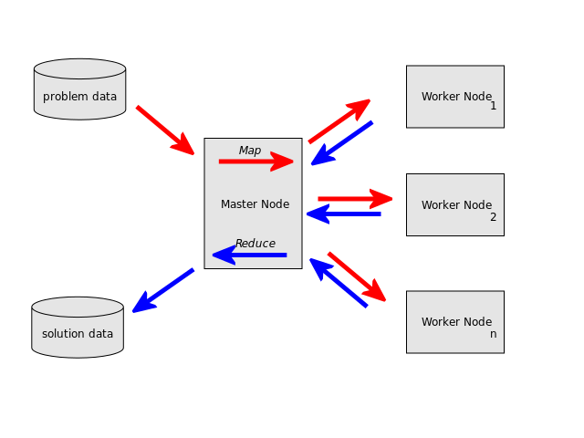

=======
NoSQL
=======

------------------------------------------------
NoSQL bāzētu datubāzu vadības sistēmu apraksts
------------------------------------------------

.. raw:: pdf

	PageBreak

NoSQL
==========

* *Not only SQL* / *No SQL*
* Specializētas datubāzes, neizmanto SQL, specifiski interfeisi (*API*)
* Nav fiksētas datu shēmas, datu struktūra var būt mainīga
* Lielākajā daļā realizāciju neeksistē JOIN konstrukcija
* Horizontālās mērogošanas atbalsts (*replication, sharding*)
 

.. raw:: pdf

	PageBreak

Kategorizācija/taksonomija
============================

* Dokumentu krātuve (*document store*).
* Atslēga-vērtība krātuve (*key-value store*).
* Grafu datubāze.
* Tabulāra krātuve (*tabular store*).
* Objektu datubāze.
* XML datubāze.

.. raw:: pdf

	PageBreak

Dokumentu krātuve
===================

* Galvenais koncepts- dokuments
* Dokuments iekapsulē datus (formāti- XML, YAML, JSON, PDF..)
* Grupēšana- pēc birkām, metadatiem
* Relāciju datubāzēs, dokuments = rinda
* Meklēšana dokumentos- atkarīga no realizācijas.

.. raw:: pdf

	PageBreak

Kolekcija vs tabula
====================================================

.. image:: images/rel_db.jpg
	:width: 45%

.. image:: images/mongodb.jpg
	:width: 45%

.. raw:: pdf

	PageBreak

Map-Reduce
==============

* Programmēšanas paņēmiens dokumentu apstrādei paralēli
* Datus apstrādā vairāki datori/serveri vienlaicīgi
* Reducē datus un atgriež rezultātus
* Reducēšanas operācijas var būt: filtrēšana, agregācija, skaitļošana

.. raw:: pdf

	PageBreak

Map-Reduce 2
================

.. raw:: pdf

	PageBreak

Pielietojumi
===============

* Izmantojams, ja datu modelis "ietilpst" dokumentu formā (lietotājs, ieraksts)
* Ir jēga tikai gadījumā, ja datu ir ļoti daudz (vairāki simti GB)
* Realizācijas pārsvarā ir optimizētas biežai lasīšanai un pievienošanai, retai dzēšanai un modificēšanai
* Ja nepieciešama paralēla dokumentu apstrāde

.. raw:: pdf

	PageBreak

Realizācijas
===============

* `Apache CouchDB <http://couchdb.apache.org/>`_
	http://couchdb.apache.org/
* `MongoDB <http://mongodb.org>`_
	http://mongodb.org/
* `Oracle NoSQL Database <http://www.oracle.com/technetwork/products/nosqldb/overview/index.html/>`_ 
	http://www.oracle.com/technetwork/products/nosqldb/overview/index.html/

.. raw:: pdf

	PageBreak

Atslēga-vērtība krātuve (*key-value store*)
==============================================

* Atslēga-vērtība koncepts (atslēga, vērtība) kortežs
* Relāciju datubāzēs- tabula ar divām kolonnām
* Parasti atslēga- primitīvs datu tips, savukārt vērtība var būt salikts datu tips
* Realizācijas parasti vērtību atgriež jau programmēšanas valodas objektos- kā masīvu, teksta virkni, int u.c.

.. raw:: pdf

	PageBreak

Piemērs
===========

.. code-block:: pycon
	:linenos:

	>>> import redis
	>>> r = redis.Redis()
	>>> r.sadd('atslega',(1,2,3))
	1
	>>> r.smembers('atslega')
	set(['(1, 2, 3)'])

	>>> r.set('vienkarsaatslega', 'abc')
	True
	>>> r.get('vienkarsaatslega')
	'abc'

.. raw:: pdf

	PageBreak

Pielietojumi
==============================

* Relatīvi īsu, bet daudzskaitlīgu, kopumā, apjomīgu datu glabāšanai
* It īpaši- izplatītās sistēmās
* Iegultajās sistēmās (HTML5 LocalStorage)
* Dati bieži tiek glabāti operatīvajā atmiņā, un tikai periodiski saglabāti cietajā diskā (ātrdarbība > konsistence)

.. raw:: pdf

	PageBreak

Realizācijas
================

* `Redis <http://redis.io/>`_ 
	http://redis.io/
* `Memcached <http://memcached.org/>`_ 
	http://memcached.org/
* `Apache Cassandra <http://cassandra.apache.org/>`_ 
	http://cassandra.apache.org/

.. raw:: pdf

	PageBreak

Grafu datubāzes
===================

* Ideāli piemērotas, ja datu kopa ir aprakstāma kā grafs
* Iebūvēti grafu algoritmi- īsākā ceļa meklēšana u.c.
* Gan virsotnēm, gan šķautnēm var būt piesaistīti dati (jēdziena "svars" paplašinājums)

Pielietojumi:

* Draudzības saites starp cilvēkiem sociālajos tīklos
* Sabiedriskā transporta sistēmas aprakstīšana (virsotnes=pieturas, šķautnes apzīmē pārvietošanos starp pieturām, īpašības uz šķautnēm- pārvietošanās laiks)

.. raw:: pdf

	PageBreak

Grafu datubāzes- vizualizācija
=================================

.. image:: images/graph.png
	:width: 70%

.. raw:: pdf

	PageBreak

Realizācijas
==============

* `Neo4j <http://neo4j.org/>`_
	http://neo4j.org/
* `Titan <http://thinkaurelius.github.com/titan/>`_
	http://thinkaurelius.github.com/titan/
* `VertexDB <http://www.dekorte.com/projects/opensource/vertexdb/>`_
	http://www.dekorte.com/projects/opensource/vertexdb/

.. raw:: pdf

	PageBreak

Secinājumi
===============

* Nav labu vai sliktu darbarīku. Ir piemēroti un nepiemēroti darbarīki.
* Relāciju datubāzes ir neaizvietojamas datiem, kuriem obligāti jānodrošina ACID īpašības.
* NoSQL datubāzes dažus ACID burtiņus aizvieto ar veiktspēju.
* Potenciāla uzturēšanas izmaksu samazināšana (viena jaudīga un dārga servera vietā izmanto vairākus lētus)

